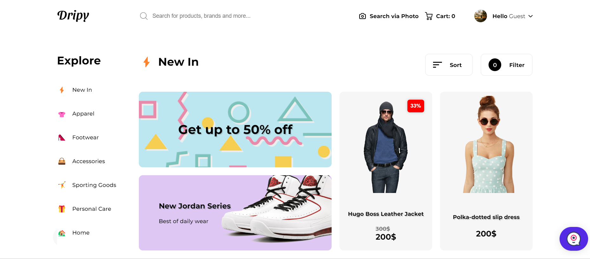
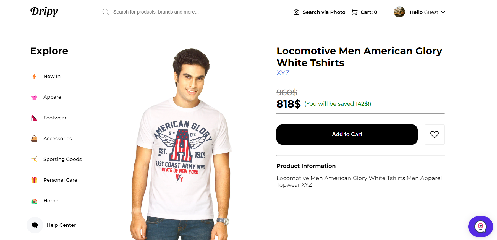
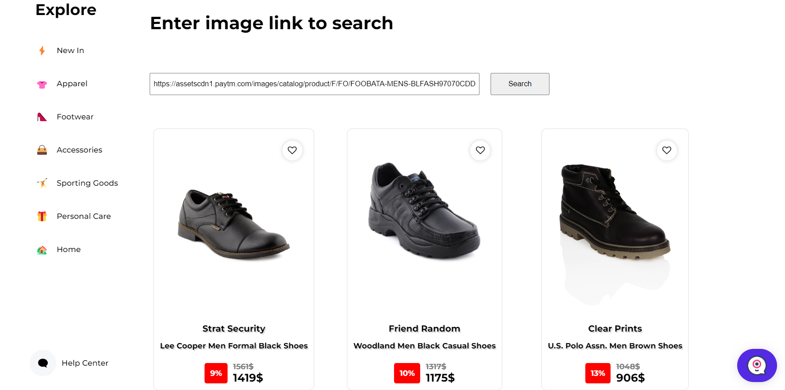
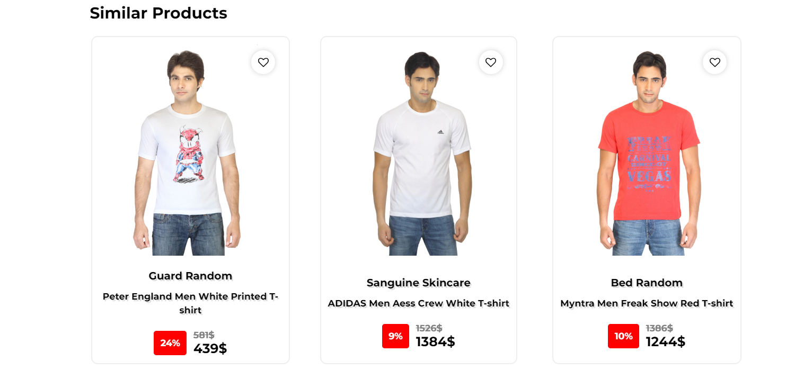
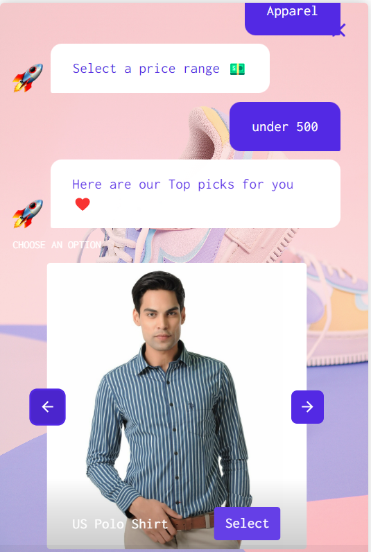
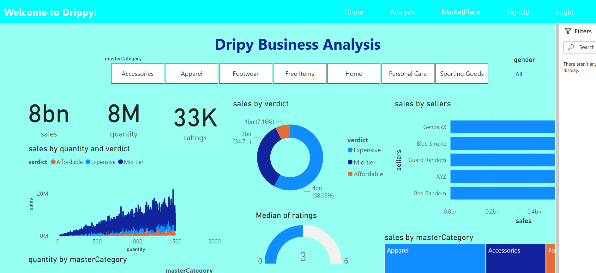

# Dripy - A fashion corner for genz's

Welcome to Dripy🙌 ! an ecommerce recommendation system built with machine learning. It has a lot of key features one of the highlight is Reverse image 🔍. Dripy also focuses on their sellers by providing them a marketplace to avail features such as logs and analysis. In future scope 💡, we also intend to add features like sentiment analysis, user segmentation and user retention predictions. Take a look at our marvellous project 👌. Fun fact - our project was among the Top 10 in the Tsec codetantra national level hackathon. If you liked our project, consider giving it a star <3 🤩

## Tech Stack

**Client:** React, Redux, TailwindCSS

**Server:** Node, Express


## Roadmap

🌐 Finding appropriate dataset - kaggle

🌐 Data cleaning & Feature selection

🌐 Start building a website to store items

🌐 Building the model in flask

🌐 ResNet50 state-of-art model integration 

🌐 Chatbot integration 

🌐 Model integration & testing

🌐 Preparing power bi report 

🌐 Publishing to power bi service

🌐 Project is ready and live


## Documentation

🔼**About our project**

Dripy is an ecommerce recommendation system where user can find similar products based on attributes like wear type, colour, sellers, category, etc. Dripy implements these features currently :
- Search products
- Reverse image search 
- Product recommendation
- Marketplace for sellers
- Sales analytics
- Chatbot for user experience 

🔼**Ecommerce Dataset - kaggle**

The dataset source taken from the kaggle platform. The images were of lower resoultion. We enhanced the images so that the classification model works properly and detect different objects efficiently.

🔆Here is the link to the dataset : [Fashion Product Images](https://www.kaggle.com/datasets/paramaggarwal/fashion-product-images-small)

🔆The dataset generated by us for the analysis and recommendation purpose : [Dripy dataset](https://github.com/prathikshetty2002/Dripy/tree/main/datasets)

🔼**Dripy website**

Our website is build upon NextJS and firebase. We have loaded the 10k+ image dataset onto our firebase db and then fetch them to our website to display the products. The data was also handled using firebase and the UI was Material design. The website was focused to be minimilastic as our main aim was to build recommendation system. But we have provided sufficient features for user to shop on our range of products.

🔼**Recommendation system**

The recommendation system works based on the image classification technique. It uses deep learning model built on ResNet50 a residual neural network to classify and find similar products for the user.
This technique is known as transfer learning, where the model has gone through a number of iterations before and trained to some extent. These sort of models provide a great accuracy and efficient to implement.

🔼**Reverse image search**

The reverse image search is similar feature such as google lens. The user must enter the url of the image it can be in any format like png,jpeg,jpg,etc. It was build using the transfer learning approach & the state-of-art model ResNet50. It is 50 layers deep and has over a million attributes that one can train. We have provided our custom dataset and trained the last layer to train it over our 10k + image items. The model has a very good accuracy thanks to the training it has gone through before the effective last layer.

🔼**Model integration**

Our model is integrated using flask, we loaded the output of our model into pickle files and used them to predict the products on key features of our deep learning model. The integration was smooth and the latency was also low. The model was predicting accurate results.

🔼**Power BI analysis**

We took the dripy sales data and prepared a power bi analysis based on the user data to help the sellers understand their marketshare and most selling units. This will help them scale their projects accordingly and cut off unecessary products from their inventory.
We have provided an interactive dashboard for the sellers, they can opt for this by availing the power bi services. We have used demo power bi service with a free trail to show the results. It is a vital compenent for the sellers.

🔼**Project Conclusion**

🌐Model gained great accuarcy with ResNet50 

🌐Reverse image search was implemented sucessfully

🌐Chatbot added for user interaction

🌐Power bi analytics provided for sellers marketplace

🌐Overall end-to-end implementation was efficient


## Run Locally

Clone the project

```bash
  git clone https://github.com/prathikshetty2002/Dripy.git
```

Go to the project directory

```bash
  cd Dripy
```
Create a virtualenv

```bash
  pip install virtualenv

  virtualenv venv
```
Activate venv
```bash
  source path/to/your/activate.sh 

```
start the flask app

```bash
  cd api.dripy.com/

  python app.py
```
Install dependencies
```bash
  cd www.dripy.com/

  npm install
```
Start the server

```bash
  npm run dev

```
Start the sellers portal

```bash
  cd www.dripysellers.com/

  npm run dev

```


## Project Snippets















## Authors

🔆 [@Jayesh Potlabattini](https://github.com/Mr-Jayesh)

🔆 [@Roshan Patil](https://www.github.com/R-ctrl-ctrl)

🔆 [@Ashutosh Pandey](https://www.github.com/ap3249)

🔆 [@Prathik Shetty](https://www.github.com/prathikshetty2002)


## Contributing

Contributions are always welcome!

See `contributing.md` for ways to get started.

Please adhere to this project's `code of conduct`.


## Feedback

If you have any feedback, please reach out to us at linuxmint78@gmail.com


## License

[](https://github.com/tterb/atomic-design-ui/blob/master/LICENSEs)


## Support

For support join our Slack channel - [AMA](https://ml-geeksworkspace.slack.com/archives/C03K2M9SBAA)

